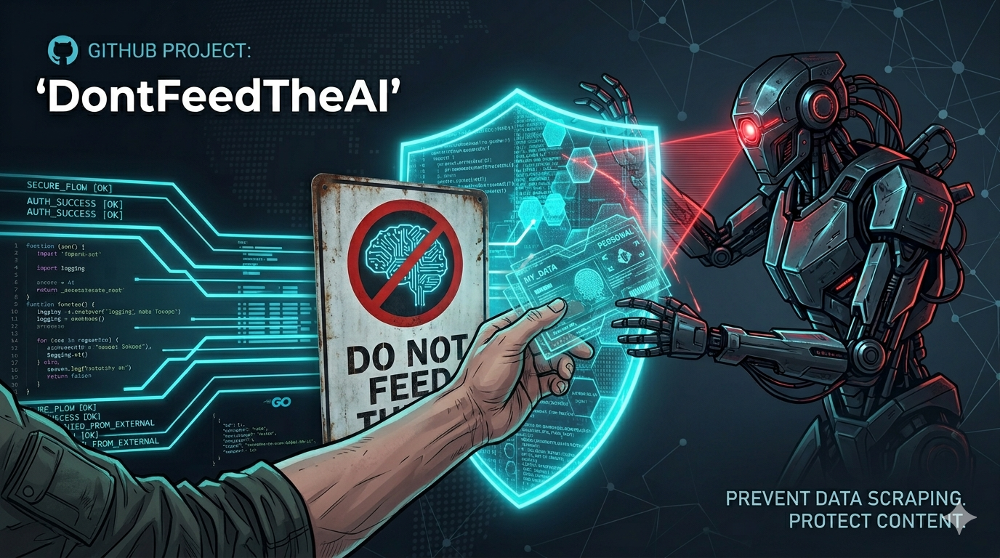
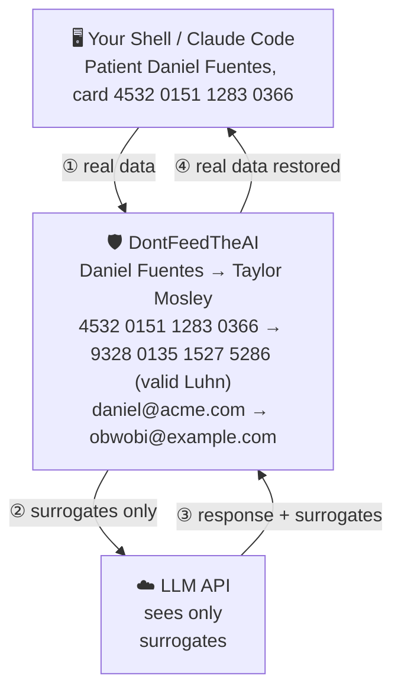
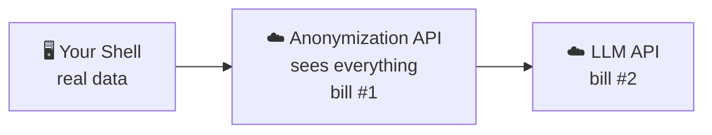
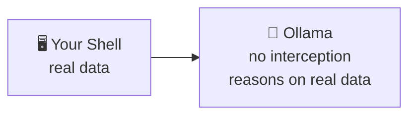
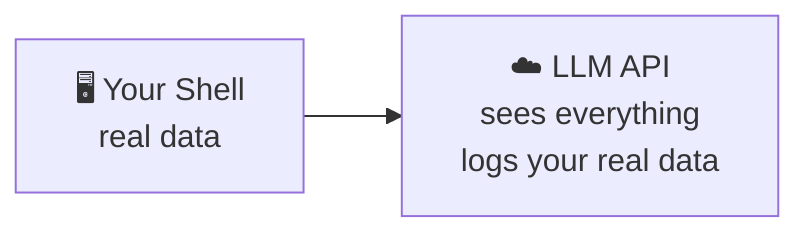
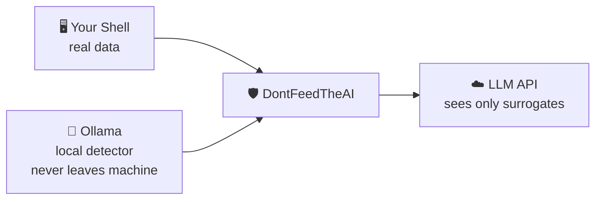

# DontFeedTheAI

<p align="center">
  
</p>

<p align="center">
  
  
  
  
  
</p>

A transparent proxy that strips names, IPs, credentials, payment data, IDs, and
other PII from every request before it reaches the AI — and restores them on the
way back. Works with **any** Claude Code usage, **including subscription plans**
(it relays your auth untouched; it never sees your API key or plan).



| Layer | Detects |
|---|---|
| 🧠 **Ollama (local LLM)** | names, org names, addresses, credentials in prose |
| 🔍 **Regex** | IPs, hashes, tokens/API keys, cards (Luhn), IBANs (mod-97), SSN/DNI, phones, MRNs |

Both run on your machine. Nothing sensitive crosses the boundary.

**PII families covered:** financial (cards · IBAN · SWIFT · accounts), identity
documents (SSN · DNI/NIE · passport · CPF/CNPJ), contact & personal (international
phones · postal addresses · dates of birth), and health (MRN · patient IDs).

---

| Who | How it helps |
|-----|-------------|
| **Developers & SREs** | Debug with production data or internal configs in regulated environments |
| **Legal & consulting** | Anonymize client contracts, case files, or proprietary IP in AI-assisted reviews |
| **Finance & compliance** | Analyze reports or audit scripts without exposing account or card details |
| **Healthcare & HR** | Review records or onboarding data without leaking patient/employee PII |
| **Researchers** | Query LLMs on confidential datasets |
| **Pentesters** | Run nmap, mimikatz, bloodhound output through Claude without exposing client infrastructure |

---

## Why not just send data directly?

**❌ Cloud anonymization API + LLM** — two bills, two third parties. Your sensitive data still leaves the machine, just through more hands.



**❌ Ollama alone** — your data never leaves the machine, but Ollama has no awareness of what's sensitive.
It reasons on whatever you paste: real IPs, real credentials, real hostnames.



**❌ Claude / OpenAI directly** — best reasoning quality, but everything lands in their infrastructure.
Real client IPs, credentials, org names in API logs — one policy change or breach away from a problem.



**✅ DontFeedTheAI** — cloud reasoning quality, local detection, nothing sensitive crosses the boundary.
Works with Claude Code, OpenAI SDK, OpenRouter, or any OpenAI-compatible client.



→ See [docs/architecture.md](docs/architecture.md) for the full technical breakdown.
For supported LLM clients and upstream configuration, see [docs/providers.md](docs/providers.md).

---

## Quick Start

**Local-first** (recommended — everything stays on your machine):

```bash
git clone https://github.com/zeroc00I/DontFeedTheAI
cd DontFeedTheAI
python3 wizard.py setup       # create venv + install dependencies
python3 wizard.py docker up   # start proxy + Ollama in Docker
export ANTHROPIC_BASE_URL=http://localhost:8080
export NAMESPACE=my-project   # isolates surrogate mappings per context
claude                        # or any OpenAI-compatible client
```

Or just run `python3 wizard.py` for a guided, interactive setup.

> **Subscription plans work too.** The proxy relays your `Authorization` /
> `x-api-key` headers untouched, so it is agnostic to how you pay — Claude Code
> logged in with a **Pro/Max subscription** routes through it exactly the same as
> pay-per-use API keys. Just point `ANTHROPIC_BASE_URL` at the proxy and launch
> `claude` as usual. (Mind your provider's terms when routing traffic through a
> proxy.)

**Advanced — with a VPS** (for team use or a persistent, always-on proxy):

```bash
python3 wizard.py            # interactive: pick the "VPS (adv.)" mode
```

The wizard asks everything — namespace, VPS address, model — then deploys, opens the SSH tunnel, and launches Claude with the proxy active.

Works on Windows, macOS, and Linux.

```bash
python3 wizard.py --help   # all available commands
```

---

## Docs

| Doc | About |
|--|--|
| [Architecture](docs/architecture.md) | Two-layer pipeline, what gets anonymized and what doesn't, config reference |
| [Providers](docs/providers.md) | Supported LLM clients: Claude Code, OpenAI SDK, OpenRouter |
| [Contributing](docs/contributing.md) | How to add fixtures, run the improvement loop, open areas |
| [Threat Model](docs/threat-model.md) | What this protects against, what it doesn't, limitations, roadmap |

---

## Verifying coverage & contributing improvements

Two tools ship with DontFeedTheAI to help you validate coverage and extend it.

**Visual audit** — open in browser while the proxy is running:

```bash
python3 wizard.py tunnel --audit
```

Shows every `ORIGINAL → SURROGATE` mapping logged during the session, filterable by entity type (DOMAIN, CREDENTIAL, TOKEN, HASH…) with per-request timing breakdown. Use it to spot leaks at a glance instead of grepping logs.


> The audit page is a **debug tool**. It exposes the full surrogate → original lookup table, which is why it only runs behind the SSH tunnel. Making this write-only (no reverse lookup over HTTP) is on the roadmap — see [Threat Model](docs/threat-model.md).

**Testing the full pipeline** — requires Ollama running:

```bash
python3 wizard.py test --integration
```

Runs all 53 fixtures through the complete pipeline (LLM + regex) and asserts zero leaks. Without `--integration`, the LLM is mocked and only the regex layer is validated — useful for fast iteration but not a substitute for the full run.

**Auto-improvement loop** — regex layer only, no Ollama required:

```bash
python3 wizard.py improve --cycles 3
```

Runs all fixtures through the regex layer, reports leaks and false positives, and tells you exactly which strings slipped through. The contribution cycle is: add a fixture for a real tool you use → run the loop → add a regex pattern for each leak → repeat. See [Contributing](docs/contributing.md).

The two commands complement each other: `improve` tightens the regex floor fast; `test --integration` confirms the full pipeline holds.

---

## A note from the author

> I'm a pentester, not a software architect.
>
> This wasn't built to be innovative — there are already cloud APIs that do LLM-based anonymization. But that means sending your data to yet another third party, and I refuse. If you work in security, you already know why.
>
> I built this so the architecture would be available to everyone, and so the community could help expand its effectiveness for free. You're paying for context processing — the AI doesn't need your real data for that.
>
> — *zeroc00I*

---

## Star History

[](https://star-history.com/#zeroc00I/DontFeedTheAI&Date)

---

## License

[MIT](LICENSE)
