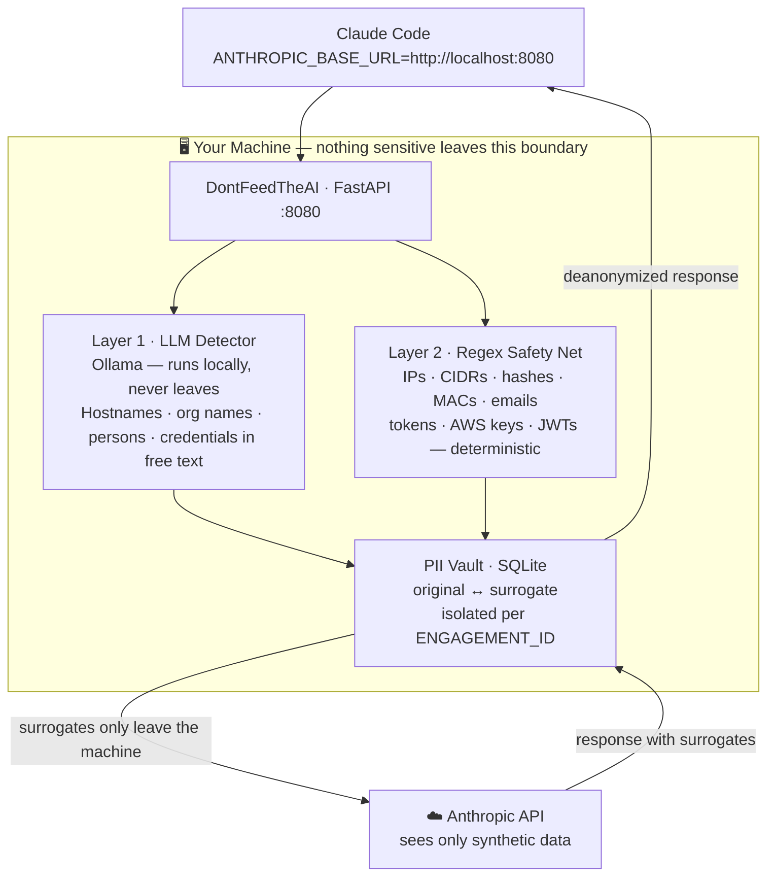

# Architecture

## Data flow

## What gets anonymized

| Category | Examples | Layer |
|----------|----------|:-----:|
| IPv4 / IPv6, CIDRs | `10.10.50.5`, `192.168.0.0/24` | Regex |
| Hashes (MD5 / NTLM / SHA) | `8846f7eaee8fb117...` | Regex |
| Domains / FQDNs / URLs | `dc01.corp.local`, `https://intranet.corp` | Regex |
| Email addresses | `john@corp.com` | Regex |
| Cloud tokens (AWS / GCP / GitHub / Stripe…) | `AKIAIOSFODNN7`, `sk_live_...` | Regex |
| JWTs, API keys, session tokens | `eyJhbGci...`, `ghp_xxxxx` | Regex |
| Bare hostnames | `DC01`, `FILESERVER-PRD` | LLM |
| Org and project names | `Contoso Corp`, `Project Phoenix` | LLM |
| Person names | `John Smith` in logs or prose | LLM |
| Domain usernames | `CORP\jsmith` | LLM |
| Cleartext credentials | `C0nt0s0@2024!` | LLM |
| Sensitive file paths | `/home/jsmith/engagements/acme` | LLM |

## What intentionally stays unchanged

Anonymizing everything would break the AI's usefulness entirely.
If you're hunting for a vulnerability in IIS 10, replacing `IIS 10` with a surrogate means Claude can't tell you which CVEs apply, which exploits work, or what the attack surface looks like.

The rule of thumb: if the value describes **what the technology is**, it stays.
If it describes **who owns it or where it lives**, it gets replaced.

| Category | Examples | Why |
|----------|----------|-----|
| Technology names and versions | `IIS 10`, `Apache 2.4.49`, `OpenSSH 8.2` | Version-specific advice depends on the exact version |
| CVE identifiers | `CVE-2021-44228`, `CVE-2019-11510` | Replacing these makes vulnerability research impossible |
| Tool names | `nmap`, `mimikatz`, `bloodhound`, `crackmapexec` | Generic tool references carry no client identity |
| Protocol names | `SMB`, `LDAP`, `Kerberos`, `HTTP`, `RDP` | Protocol-level advice requires knowing the actual protocol |
| Port numbers | `445`, `443`, `8080`, `3389` | Port context is needed for meaningful analysis |
| OS names | `Windows Server 2019`, `Ubuntu 22.04` | Attack paths are OS-specific |
| HTTP status codes | `403 Forbidden`, `500 Internal Server Error` | Generic error taxonomy, not client-specific |

## Surrogate format

Surrogates are realistic but clearly non-routable.
The same original always maps to the same surrogate within an engagement.

| Original | Surrogate |
|----------|-----------|
| `192.168.1.10` | `203.0.113.47` *(RFC 5737 TEST-NET)* |
| `dc01.contoso.local` | `xkqpzt.pentest.local` |
| `DC01` | `dc-0042` |
| `john.smith` | `user_rfkw` |
| `john@corp.com` | `rfkwma@example.pentest` |
| `C0nt0s0@2024!` | `[CRED_XK9A2B3C]` |

## Configuration reference

| Variable | Default | Description |
|----------|---------|-------------|
| `ENGAGEMENT_ID` | `default` | **Change per client.** Isolates surrogate mappings. |
| `OLLAMA_HOST` | `http://localhost:11434` | Ollama endpoint |
| `OLLAMA_MODEL` | `qwen3:1.7b` | Override the auto-suggested model |
| `LLM_ENABLED` | `true` | Set to `false` for regex-only mode (faster, lower coverage) |
| `OLLAMA_TIMEOUT` | `120` | Seconds before LLM falls back to regex-only |
| `LLM_CHUNK_SIZE` | `1500` | Characters per chunk for long tool outputs |
| `PORT` | `8080` | Proxy listen port |

## Source map

| File | Role |
|------|------|
| `src/anonymizer.py` | Orchestrates LLM + regex detection and vault replacement |
| `src/regex_detector.py` | Deterministic patterns — IPs, hashes, tokens, paths |
| `src/llm_detector.py` | Contextual detection via Ollama |
| `src/vault.py` | Per-engagement SQLite surrogate store |
| `src/surrogates.py` | Generates realistic fake replacements by entity type |
| `src/verifier.py` | Post-anonymization leak check |
| `data/system_prompt.txt` | LLM detector system prompt |
