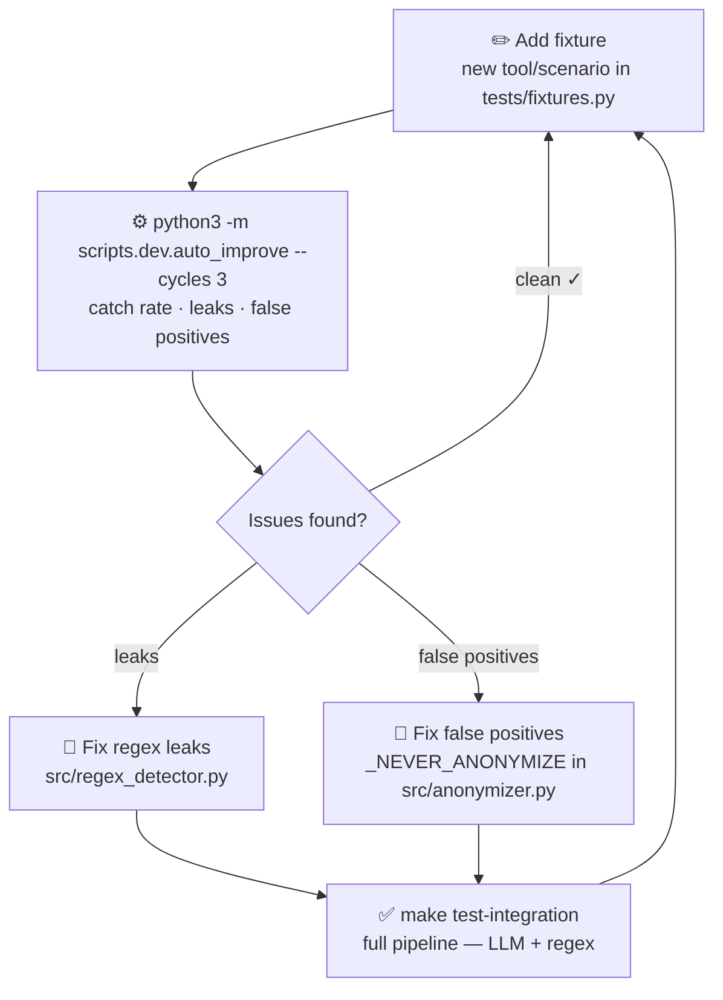

# Contributing

The highest-impact contribution is a **new fixture** for a tool or scenario not yet covered.
The improvement cycle runs in under 5 seconds with no Ollama required.

## The loop



## Step 1 — Write a fixture

```python
# tests/fixtures.py
MY_SCENARIO = PentestFixture(
    name="my_tool_output",
    description="One sentence — tool and scenario",
    text="""\
<realistic tool output — use FICTIONAL IPs, hostnames, org names>
""",
    must_anonymize=["192.168.1.10", "victim.corp", "SuperSecret123!"],
    safe_to_keep=["nmap", "smb", "443"],
)
# Add MY_SCENARIO to ALL_FIXTURES at the bottom
```

> **Important:** Use entirely fictional data. Never include real engagement output.

## Step 2 — Run the improvement loop

```bash
python3 -m scripts.dev.auto_improve --cycles 3
```

## Step 3 — Fix what leaks, repeat

- Regex leaks → add patterns to `src/regex_detector.py`
- False positives → add terms to `_NEVER_ANONYMIZE` in `src/anonymizer.py`
- LLM misses → improve `data/system_prompt.txt`

## Coverage history

| Fixtures | Items | Catch rate | Milestone |
|:--------:|:-----:|:----------:|-----------|
| 16 | ~160 | ~85% | Initial patterns |
| 16 | ~160 | ~97% | LLM layer added |
| 37 | 495 | 100% | Kerberos, NTLM, AWS, AD CS, cloud tokens |
| 46 | 610 | 100% | Empire C2, Pacu, Volatility, GoPhish, Shodan, CloudTrail |
| 49 | 645 | 100% | CrackMapExec SMB, Burp Suite, Zeek conn.log |
| **53** | **679** | **99.6%** | Nuclei, Hashcat, Suricata, ADB mobile |

## Open areas

| Area | Examples |
|------|----------|
| New fixtures | `feroxbuster`, `ffuf`, `tcpdump` cleartext creds, Cobalt Strike, OT/SCADA |
| Cloud coverage | Azure `az ad`, GCP `gcloud iam`, AWS CloudTrail |
| Mobile / IoT | `adb shell`, firmware strings, `frida` hooks |
| LLM prompt | Improve `data/system_prompt.txt` for contextual entities |
| Performance | Ollama batching, response streaming, chunk caching |

## Running tests

```bash
# Regex + unit, no Ollama, ~5s
make test

# Full pipeline with LLM
OLLAMA_HOST=http://localhost:11434 make test-integration
```

The suite enforces a **0% leak policy**: every string in `must_anonymize` across all fixtures must be absent from the anonymized output.
